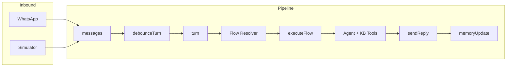

# WhatsApp Agentic Engine

Sistema agentic conversacional profesional construido en **Next.js + MongoDB** que permite orquestar agentes LLM con memoria, tools, flows configurables y testing integrado.

## Visión general

Motor agentic que:

- ✅ Ingesta mensajes desde WhatsApp (Baileys) o simulador interno
- ✅ Consolida inputs en turns con debouncing
- ✅ Ejecuta flows configurables por sesión
- ✅ Orquesta agentes LLM con function calling
- ✅ Mantiene memoria conversacional (facts + recap)
- ✅ Soporta modo humano con cooldown automático
- ✅ Testing harness integrado (chat simulator)
- ✅ Totalmente trazable y observable

**Arquitectura orientada a:** determinismo + observabilidad + extensibilidad

---

## Arquitectura

### Pipeline completo

```
message → debounceTurn → turn
turn → executeFlow → agent + tools + KB
agent → sendReply → outbound
→ memoryUpdate → facts + recap
```

### Diagrama de flujo (Mermaid)



Flujo: **WhatsApp/Sim** → messages → debounceTurn → turn → **Flow Resolver** (draft/published) → executeFlow → **Agent** (con KB Tools) → sendReply → memoryUpdate.

### Diagrama de flujo (ASCII)

```
┌─────────────────────────────────────────────────────────────┐
│                    Inbound (WhatsApp / Sim)                  │
└──────────────────────────┬──────────────────────────────────┘
                           ↓
┌─────────────────────────────────────────────────────────────┐
│  messages collection (processed: false)                      │
└──────────────────────────┬──────────────────────────────────┘
                           ↓
┌─────────────────────────────────────────────────────────────┐
│  debounceTurn job (3s)                                       │
└──────────────────────────┬──────────────────────────────────┘
                           ↓
┌─────────────────────────────────────────────────────────────┐
│  turn creation (consolidate messages)                        │
└──────────────────────────┬──────────────────────────────────┘
                           ↓
┌─────────────────────────────────────────────────────────────┐
│  resolveFlow(sessionId) → draft/published o filesystem        │
└──────────────────────────┬──────────────────────────────────┘
                           ↓
┌─────────────────────────────────────────────────────────────┐
│  executeFlow (simple/FSM mode)                               │
│    - KB v2 (md + tables)                                     │
│    - run agent + tools                                       │
└──────────────────────────┬──────────────────────────────────┘
                           ↓
┌─────────────────────────────────────────────────────────────┐
│  sendReply (if responses enabled)                            │
└──────────────────────────┬──────────────────────────────────┘
                           ↓
┌─────────────────────────────────────────────────────────────┐
│  memoryUpdate (facts + recap)                                │
└─────────────────────────────────────────────────────────────┘
```

---

## Stack tecnológico

- **Framework**: Next.js 16.1.6 (App Router)
- **Base de datos**: MongoDB
- **LLM**: OpenAI (gpt-4o-mini / gpt-4o / gpt-5-mini / gpt-5-nano)
- **UI**: React 19 + shadcn/ui + Tailwind CSS 4 + Monaco Editor
- **WhatsApp**: Baileys API (webhook + send)
- **Worker**: tsx (local) + Vercel Cron
- **TypeScript**: strict mode

---

## UI de Administración

Interfaz protegida por autenticación (`/login`) para gestionar sesiones, flows, prompts y KB.

### Dashboard principal (`/`)

- Monitor de salud: estado de Baileys API (latencia) y MongoDB
- Tabla de sesiones: estado, conteo de conversaciones, última actividad
- Enlaces rápidos: simulador y configuración de flow por sesión

### Configuración de sesión (`/ui/sessions/[sessionId]`)

- **Editor de flows**: JSON con Monaco Editor; validar, guardar draft y publicar
- **Diff viewer**: comparación draft vs published (unified diff)
- **Editor de prompts por agente**: `default_assistant`, `cami_default`, `cami_recommender`
  - System prompt, model, temperature, max tool rounds
  - Draft/publish con validación (longitud, placeholders)
- **Runtime config**: modo de resolución
  - `auto`: usa published si existe, sino filesystem
  - `force_draft`: fuerza draft (testing)
  - `force_published`: fuerza published
- Enlaces rápidos: simulador, KB manager, conversaciones

### Knowledge Base Manager (`/kb/[sessionId]`)

- **Tab Markdown**: CRUD de documentos (slug, título, contenido); preview; filtro por estado (active/archived)
- **Tab Tables**: listado de tablas KB; consulta de filas con búsqueda por texto
- Los documentos markdown se reindexan automáticamente al guardar

### Lista de conversaciones (`/conversations`)

- Tabla de conversaciones con filtro por sesión (todas o una)
- Último mensaje, estado de respuestas (habilitadas/cooldown)
- Enlace al detalle de conversación (`/conversations/[whatsappId]`)

### Detalle de conversación (`/conversations/[whatsappId]`)

- Historial de mensajes
- Toggle para habilitar/deshabilitar respuestas del bot
- Formulario para enviar mensaje manual (opcional)

---

## Fase 1 — Message Gateway + Persistencia

### Objetivo

Infraestructura propia para reemplazar n8n.

### Flujo

**Inbound:**

```
Webhook → messages (processed=false)
```

**Outbound:**

```
sendReply → Baileys API → messages (source=bot)
```

### Modelo: `messages`

```ts
{
  whatsappId: string        // conversation key
  sessionId: string         // bot connection
  userID: string
  channel: "whatsapp" | "simulator"
  messageText: string
  messageTime: number
  source: "user" | "bot"
  processed: boolean
  botMessageId?: string
}
```

**Índices:** por conversación + estado.

### Endpoints

- `POST /api/whatsapp/webhook` — recibe mensajes de Baileys
- `POST /api/whatsapp/send` — envía mensajes via Baileys
- `POST /api/conversations/[whatsappId]/responses-enabled` — control de modo humano

---

## Fase 2 — Agentic Runtime

### Modelos clave

#### `turns` (input estable)

```ts
{
  whatsappId: string
  sessionId: string
  userID: string
  text: string
  messageIds: ObjectId[]
  status: "queued" | "running" | "done" | "failed" | "blocked"
  router?: string
  response?: string
  channel: "whatsapp" | "simulator"
  meta?: Record<string, unknown>
  createdAt: Date
}
```

#### `agent_runs` (traza completa)

```ts
{
  turnId: ObjectId
  agentId: string
  input: {
    systemPrompt: string
    context: string
    messages: Array<{role, content}>
  }
  output?: {
    assistantText?: string
    toolCalls?: ToolCall[]
  }
  status: "pending" | "running" | "done" | "failed"
  error?: string
  createdAt: Date
  updatedAt: Date
}
```

#### `memory`

```ts
{
  whatsappId: string;
  facts: Array<{
    key: string;
    value: string;
    confidence: number;
  }>;
  recap: {
    text: string;
    updatedAt: Date;
  }
  updatedAt: Date;
}
```

#### `conversation_state`

Estado estructural por conversación (FSM, pasos, datos personalizados).

```ts
{
  whatsappId: string
  sessionId: string
  state?: string
  data?: Record<string, unknown>
  updatedAt: Date
}
```

#### `jobs`

Cola interna (MongoDB) con:

- `debounceTurn` — consolida mensajes
- `runAgent` — ejecuta agente
- `sendReply` — envía respuesta
- `memoryUpdate` — actualiza memoria

```ts
{
  type: string
  status: "pending" | "running" | "done" | "failed"
  payload: Record<string, unknown>
  retries: number
  maxRetries: number
  scheduledAt: Date
  lockedBy?: string
  lockedAt?: Date
  error?: string
}
```

### Router de agentes

Orden de resolución:

1. **Reglas determinísticas** (keywords, comandos)
2. **Fallback LLM** (JSON classifier con GPT-4o-mini)

Agentes disponibles:

- `default_assistant` — asistente general
- `cami_default` — agente Cami base
- `cami_recommender` — recomendador especializado

### Tools disponibles

Function calling integrado. **Total: 9 tools** (4 core + 5 KB v2).

**Core:**

- `send_message` — envía mensaje adicional al usuario
- `set_responses_enabled` — activa/desactiva respuestas automáticas (con cooldown opcional)
- `get_recent_messages` — obtiene historial reciente (límite configurable)
- `http_fetch` — HTTP GET a URLs permitidas (safe, timeout)

**KB v2:**

- `kb_md_search` — búsqueda en documentos markdown
- `kb_md_get` — obtener documento completo por slug
- `kb_table_lookup` — búsqueda en tabla por texto
- `kb_table_get` — obtener fila por clave primaria
- `kb_table_query` — query estructurado con filtros

### Modo humano

Control por conversación:

```ts
responsesEnabled = {
  enabled: boolean
  disabledUntilUTC?: string  // cooldown hasta timestamp
}
```

- Se activa automáticamente cuando entra mensaje `fromMe`
- Cooldown por defecto: 2 horas
- Respetado antes de toda respuesta automática

**Endpoints:**

- `GET /api/conversations/[whatsappId]/responses-enabled`
- `POST /api/conversations/[whatsappId]/responses-enabled`

---

## Fase 3 — Flows por sesión

> `sessionId` = una conexión/bot; múltiples conversaciones por sesión.

Flows pueden vivir en **MongoDB** (draft/published) o en **filesystem** (`/flows/default`, `/flows/session_<id>`). Ver [Gestión de Flows y Prompts](#gestión-de-flows-y-prompts).

### Estructura en repo

```
/flows
  /default
    flow.json
    kb/*.md
  /session_<id>
    flow.json
    kb/*
```

### Resolución

Según `sessionRuntimeConfig.configMode`: **auto** (published si existe, sino filesystem), **force_draft** o **force_published**. Si no hay flow en DB, se usa filesystem: `session_<sessionId>` si existe, sino `default`.

### Modos de flow (MVP)

#### 1. Simple

```json
{
  "mode": "simple",
  "agent": "default_assistant",
  "kb": {
    "enabled": true,
    "topK": 4
  }
}
```

#### 2. FSM (Finite State Machine)

Estados con `reply`, `agent`, `router` o `end`. Transiciones con `match: { keyword }`, `match: { any: true }` o `match: { default: true }`. Estado persistido en `conversation_state`.

**Ejemplo mínimo:**

```json
{
  "mode": "fsm",
  "initialState": "greeting",
  "states": {
    "greeting": {
      "reply": "¡Hola! ¿En qué puedo ayudarte?",
      "transitions": [{ "match": { "any": true }, "next": "ROUTER" }]
    },
    "ROUTER": {
      "router": {
        "type": "keyword",
        "routes": [
          { "keyword": "hola", "next": "SALUDO" },
          { "default": true, "next": "NO_ENTENDI" }
        ]
      }
    },
    "SALUDO": {
      "reply": "Hola! En qué puedo ayudarte?",
      "transitions": [{ "match": { "any": true }, "next": "ROUTER" }]
    },
    "NO_ENTENDI": {
      "reply": "No llegué a entender. ¿Me contás qué buscás?",
      "transitions": [{ "match": { "any": true }, "next": "ROUTER" }]
    }
  }
}
```

**Router por keywords:**

```json
{
  "router": {
    "type": "keyword",
    "routes": [
      { "keyword": "hola", "next": "SALUDO" },
      { "keyword": "pedido", "next": "ESCALATE" },
      { "default": true, "next": "NO_CLARO" }
    ]
  }
}
```

**Router por AI (LLM):**

```json
{
  "router": {
    "type": "ai",
    "instruction": "Clasifica la intención del usuario.",
    "routes": [
      {
        "name": "comprar",
        "description": "Usuario quiere comprar",
        "next": "COMPRA"
      },
      { "name": "consulta", "description": "Tiene una pregunta", "next": "FAQ" }
    ]
  }
}
```

**Ejemplo real:** [flows/session_iutopyBusiness/flow.json](flows/session_iutopyBusiness/flow.json) — FSM con 12+ categorías de productos, routers keyword anidados (ej. semillas → interior/exterior → auto/foto → agente), estados de escalamiento a humano y offtopic.

---

## Sistema KB v2

Sistema dual: documentos markdown y tablas estructuradas, por sesión. Los agentes acceden vía tools (`kb_md_*`, `kb_table_*`).

### Markdown KB

- **Colecciones**: `kbMdDocs` (documentos), `kbMdChunks` (chunks)
- **Campos**: slug, title, content, status (active/archived)
- **Chunking**: por headers; chunks hasta 3200 caracteres con overlap 400
- **Búsqueda**: texto en MongoDB con scoring; filtro por slug
- **API CRUD**:
  - `POST /api/kb/md` — crear documento (body: sessionId, slug, title, content)
  - `GET /api/kb/md` — listar (query: sessionId, status)
  - `GET /api/kb/md/[docId]` — obtener
  - `PUT /api/kb/md/[docId]` — actualizar (dispara reindex)
  - `DELETE /api/kb/md/[docId]` — archivar

### Tables KB

- **Colecciones**: `kbTables` (definición), `kbRows` (filas), `kbSyncRuns` (historial de sync)
- **Sincronización**: desde n8n u otro cliente vía `POST /api/kb/tables/[sessionId]/[tableKey]/sync`
  - Header: `Authorization: Bearer <KB_SYNC_TOKEN>`
  - Payload: `batchId`, `mode: "mirror"`, `primaryKey`, `rows` (máx. 10.000)
  - Modo mirror: upsert por primaryKey y borra filas no presentes en el batch
  - Idempotencia: mismo `batchId` no reprocesa
- **Consulta**: búsqueda por texto con scoring; extracción de hints numéricos (ej. "20l", "20 lts")
- **API**:
  - `GET /api/kb/tables` — listar tablas (query: sessionId)
  - `GET /api/kb/tables/[sessionId]/[tableKey]/rows` — filas (query: query, limit)

Documentación detallada: [docs/KB_SYNC_API.md](docs/KB_SYNC_API.md).

### Agent tools KB (v2)

- `kb_md_search` — búsqueda en documentos markdown
- `kb_md_get` — obtener documento completo por slug
- `kb_table_lookup` — búsqueda en tabla por texto
- `kb_table_get` — obtener fila por clave primaria
- `kb_table_query` — query estructurado con filtros

---

## Gestión de Flows y Prompts

Flows y prompts se pueden editar en **draft** en MongoDB y publicar a producción sin redeploy.

### Versionado draft/published

1. Editar flow o prompt en **draft** (guardado en MongoDB)
2. Validar (sintaxis, referencias a agentes/estados)
3. Ver diff vs published
4. Publicar; el runtime usa published (o draft si `force_draft`)

### Colecciones

- `flowDocuments`: flow por sesión (draft + published)
- `agentPromptDocuments`: prompt por sesión y agente (draft + published)
- `sessionRuntimeConfig`: modo de resolución (auto / force_draft / force_published)

### Resolución en runtime

- `auto` (default): usa published si existe, sino flow/prompt desde filesystem
- `force_draft`: usa siempre draft (útil para testing en simulador)
- `force_published`: usa siempre published

### API Flows

| Método | Ruta                                                         | Descripción             |
| ------ | ------------------------------------------------------------ | ----------------------- |
| GET    | `/api/ui/sessions/[sessionId]/flow?version=draft\|published` | Obtener flow            |
| PUT    | `/api/ui/sessions/[sessionId]/flow`                          | Actualizar draft        |
| POST   | `/api/ui/sessions/[sessionId]/flow/publish`                  | Publicar draft          |
| POST   | `/api/ui/sessions/[sessionId]/flow/validate`                 | Validar sin guardar     |
| GET    | `/api/ui/sessions/[sessionId]/flow/diff`                     | Diff draft vs published |

### API Prompts

| Método | Ruta                                                                            | Descripción      |
| ------ | ------------------------------------------------------------------------------- | ---------------- |
| GET    | `/api/ui/sessions/[sessionId]/agents/[agentId]/prompt?version=draft\|published` | Obtener prompt   |
| PUT    | `/api/ui/sessions/[sessionId]/agents/[agentId]/prompt`                          | Actualizar draft |
| POST   | `/api/ui/sessions/[sessionId]/agents/[agentId]/prompt/publish`                  | Publicar draft   |

### API Runtime config

| Método | Ruta                                          | Descripción                                      |
| ------ | --------------------------------------------- | ------------------------------------------------ |
| GET    | `/api/ui/sessions/[sessionId]/runtime-config` | Obtener configMode                               |
| PUT    | `/api/ui/sessions/[sessionId]/runtime-config` | Actualizar configMode (limpia caché de resolver) |

Todas las rutas bajo `/api/ui/` requieren autenticación.

---

## Chat Simulator (testing real)

### Principio clave

No es otro sistema → es otro **canal**. Todo el pipeline es el mismo que en WhatsApp: messages → turns → flow resolver → agent + KB tools → sendReply → memoryUpdate.

### Identidad de conversación

Reutiliza `whatsappId` con prefijo:

```
sim:<sessionId>:<testUserId>
```

Ejemplo: `sim:default:user_1`. Aísla estado y memoria por conversación de prueba.

### UI (`/sim` y `/sim/[sessionId]`)

- **Selector de sesión** y lista de conversaciones simuladas (crear nueva con `testUserId`)
- **Chat window**: envío de mensajes; indicador de config activa (Draft/Published)
- **Override de config**: query param para forzar draft o published en esa conversación
- **Acciones**: reset de conversación (limpia state + memory), clear cooldown, export JSON

### Debug panel

En tiempo real para la conversación activa:

- **Turn**: status, agentId, duración, flow path, estado FSM
- **AI classification**: ruta elegida, confidence, reasoning (si aplica)
- **KB usage**: chunks markdown usados (títulos), filas de tabla usadas (detalle), contadores totales
- **Cooldown**: estado y control para activar/deshabilitar respuestas
- **Flow**: modo (simple/FSM) y estado actual

### API Simulator

| Método | Ruta                                               | Descripción                                                  |
| ------ | -------------------------------------------------- | ------------------------------------------------------------ |
| GET    | `/api/sim/sessions/[sessionId]/conversations`      | Listar conversaciones                                        |
| POST   | `/api/sim/sessions/[sessionId]/conversations`      | Crear (body: `testUserId`)                                   |
| GET    | `/api/sim/conversations/[conversationId]/messages` | Historial (límite 200)                                       |
| POST   | `/api/sim/conversations/[conversationId]/messages` | Enviar mensaje (opcional: `configOverride`: draft/published) |
| POST   | `/api/sim/conversations/[conversationId]/reset`    | Reset state y memoria                                        |

Para debug de turns y agent runs se reutilizan:

- `GET /api/conversations/[whatsappId]/turns`
- `GET /api/turns/[turnId]`
- `GET /api/agent-runs/[runId]`

### sendReply

Por canal: `whatsapp` → Baileys API; `simulator` → solo persistencia en `messages` (sin envío HTTP).

---

## Instalación

### Requisitos

- Node.js 20+
- MongoDB 6+
- OpenAI API Key
- Baileys API (opcional, para WhatsApp real)

### Setup

1. Clonar repo:

```bash
git clone <repo-url>
cd whatsapp-bot-v2
npm install
```

2. Configurar `.env`:

```bash
# MongoDB
MONGODB_URI=mongodb://localhost:27017
MONGODB_DB_NAME=whatsapp_agentic

# OpenAI
OPENAI_API_KEY=sk-...

# Baileys (opcional, para WhatsApp real)
BAILEYS_API_URL=http://localhost:3001
BAILEYS_API_KEY=your-secret-key

# Cron (opcional, para Vercel)
CRON_SECRET=your-cron-secret

# Login (opcional)
LOGIN_USERNAME=admin
LOGIN_PASSWORD=secret

# KB sync desde n8n (opcional)
KB_SYNC_TOKEN=your-kb-sync-token
```

3. Iniciar desarrollo:

```bash
npm run dev
```

4. Iniciar worker (local):

```bash
npm run worker
```

---

## Uso

### Testing con Simulator

1. Ir a `http://localhost:3000/sim`
2. Seleccionar `sessionId` (ej: `default`)
3. Crear conversación de prueba
4. Enviar mensajes
5. Ver debug panel en tiempo real

### Producción con WhatsApp

1. Configurar Baileys API
2. Configurar webhook en Baileys → `https://your-domain.com/api/whatsapp/webhook`
3. Enviar header `Authorization: Bearer <BAILEYS_API_KEY>`
4. Configurar Vercel Cron (opcional):

```json
{
  "crons": [
    {
      "path": "/api/cron/jobs",
      "schedule": "* * * * *"
    }
  ]
}
```

5. Deploy a Vercel:

```bash
vercel --prod
```

---

## Scripts

| Script                    | Descripción                                                                                             |
| ------------------------- | ------------------------------------------------------------------------------------------------------- |
| `npm run dev`             | Desarrollo con Turbo                                                                                    |
| `npm run build`           | Build de producción                                                                                     |
| `npm start`               | Servidor de producción                                                                                  |
| `npm run worker`          | Worker local: procesa jobs (debounceTurn, runAgent, sendReply, memoryUpdate, kbReindexMarkdown) en loop |
| `npm run lint`            | Linter                                                                                                  |
| `npm run seed-kb`         | Seed inicial de KB desde archivos en `flows/*/kb/`                                                      |
| `npm run test-classifier` | Prueba del clasificador AI (router tipo `ai`)                                                           |

**Scripts de migración** (ejecutar con `npx tsx`):

- `scripts/migrate-flows-to-db.ts` — migrar flows desde filesystem a MongoDB (draft/published)
- `scripts/migrate-prompts-to-db.ts` — migrar prompts de agentes desde defaults a MongoDB

---

## Endpoints principales

### Auth

| Método | Ruta               | Descripción                                                  |
| ------ | ------------------ | ------------------------------------------------------------ |
| POST   | `/api/auth/login`  | Login (body: username, password); establece cookie de sesión |
| POST   | `/api/auth/logout` | Logout; limpia cookie                                        |

### Dashboard

| Método | Ruta                      | Descripción                                                     |
| ------ | ------------------------- | --------------------------------------------------------------- |
| GET    | `/api/dashboard/overview` | Resumen del sistema (Baileys, MongoDB, sesiones); requiere auth |

### WhatsApp

| Método | Ruta                    | Descripción                |
| ------ | ----------------------- | -------------------------- |
| POST   | `/api/whatsapp/webhook` | Recibe mensajes de Baileys |
| POST   | `/api/whatsapp/send`    | Envía mensaje vía Baileys  |

### Conversaciones

| Método | Ruta                                                | Descripción                                                 |
| ------ | --------------------------------------------------- | ----------------------------------------------------------- |
| GET    | `/api/conversations`                                | Lista conversaciones (query: `sessionId`)                   |
| GET    | `/api/conversations/[whatsappId]/messages`          | Mensajes de la conversación                                 |
| GET    | `/api/conversations/[whatsappId]/turns`             | Historial de turns (query: `limit`, máx. 50)                |
| GET    | `/api/conversations/[whatsappId]/responses-enabled` | Estado de respuestas                                        |
| POST   | `/api/conversations/[whatsappId]/responses-enabled` | Actualizar respuestas (body: `enabled`, `disabledUntilUTC`) |

### Turns y agent runs (debug)

| Método | Ruta                      | Descripción                    |
| ------ | ------------------------- | ------------------------------ |
| GET    | `/api/turns/[turnId]`     | Detalle de turn                |
| GET    | `/api/agent-runs/[runId]` | Detalle de ejecución de agente |

### UI — Flows y prompts (requieren auth)

| Método | Ruta                                                           | Descripción                                      |
| ------ | -------------------------------------------------------------- | ------------------------------------------------ |
| GET    | `/api/ui/sessions/[sessionId]/flow`                            | Obtener flow (query: `version=draft\|published`) |
| PUT    | `/api/ui/sessions/[sessionId]/flow`                            | Actualizar draft                                 |
| POST   | `/api/ui/sessions/[sessionId]/flow/publish`                    | Publicar flow                                    |
| POST   | `/api/ui/sessions/[sessionId]/flow/validate`                   | Validar sin guardar                              |
| GET    | `/api/ui/sessions/[sessionId]/flow/diff`                       | Diff draft vs published                          |
| GET    | `/api/ui/sessions/[sessionId]/agents/[agentId]/prompt`         | Obtener prompt                                   |
| PUT    | `/api/ui/sessions/[sessionId]/agents/[agentId]/prompt`         | Actualizar draft de prompt                       |
| POST   | `/api/ui/sessions/[sessionId]/agents/[agentId]/prompt/publish` | Publicar prompt                                  |
| GET    | `/api/ui/sessions/[sessionId]/runtime-config`                  | Obtener configMode                               |
| PUT    | `/api/ui/sessions/[sessionId]/runtime-config`                  | Actualizar configMode                            |

### Knowledge Base

| Método | Ruta                                         | Descripción                                                    |
| ------ | -------------------------------------------- | -------------------------------------------------------------- |
| GET    | `/api/kb/md`                                 | Listar documentos (query: `sessionId`, `status`)               |
| POST   | `/api/kb/md`                                 | Crear documento                                                |
| GET    | `/api/kb/md/[docId]`                         | Obtener documento                                              |
| PUT    | `/api/kb/md/[docId]`                         | Actualizar documento                                           |
| DELETE | `/api/kb/md/[docId]`                         | Archivar documento                                             |
| GET    | `/api/kb/tables`                             | Listar tablas (query: `sessionId`)                             |
| GET    | `/api/kb/tables/[sessionId]/[tableKey]/rows` | Filas (query: `query`, `limit`)                                |
| POST   | `/api/kb/tables/[sessionId]/[tableKey]/sync` | Sync desde n8n (header: `Authorization: Bearer KB_SYNC_TOKEN`) |

### Simulator

| Método | Ruta                                               | Descripción                |
| ------ | -------------------------------------------------- | -------------------------- |
| GET    | `/api/sim/sessions/[sessionId]/conversations`      | Listar conversaciones      |
| POST   | `/api/sim/sessions/[sessionId]/conversations`      | Crear (body: `testUserId`) |
| GET    | `/api/sim/conversations/[conversationId]/messages` | Historial                  |
| POST   | `/api/sim/conversations/[conversationId]/messages` | Enviar mensaje             |
| POST   | `/api/sim/conversations/[conversationId]/reset`    | Reset conversación         |

### Cron

| Método | Ruta             | Descripción                                                         |
| ------ | ---------------- | ------------------------------------------------------------------- |
| GET    | `/api/cron/jobs` | Procesa hasta 10 jobs (header: `Authorization: Bearer CRON_SECRET`) |

---

## Estructura del proyecto

```
whatsapp-bot-v2/
├── app/
│   ├── api/
│   │   ├── auth/            # Login / logout
│   │   ├── dashboard/      # Overview del sistema
│   │   ├── whatsapp/       # Gateway WhatsApp
│   │   ├── conversations/  # Gestión conversaciones
│   │   ├── turns/          # Debug turns
│   │   ├── agent-runs/     # Debug agent runs
│   │   ├── ui/             # Flows, prompts, runtime-config (auth)
│   │   ├── kb/             # Markdown docs + tables
│   │   ├── sim/            # Simulator endpoints
│   │   └── cron/           # Worker cron
│   ├── ui/sessions/[sessionId]/  # Configuración de sesión (flows, prompts)
│   ├── kb/[sessionId]/     # KB Manager UI
│   ├── sim/                # Simulator UI
│   ├── conversations/      # Lista y detalle de conversaciones
│   ├── login/              # Auth
│   └── page.tsx            # Dashboard principal
├── lib/
│   ├── agents/             # Agentes + tools
│   ├── flows/              # Flow engine (resolver, runtime, validator)
│   ├── kb/                 # KB legacy
│   ├── kb-v2/              # KB v2 (md + tables, sync)
│   ├── jobs.ts             # Job queue
│   ├── memory.ts           # Memoria conversacional
│   ├── router.ts           # Router de agentes
│   └── turns.ts            # Turn management
├── flows/
│   ├── default/            # Flow por defecto
│   │   ├── flow.json
│   │   └── kb/
│   └── session_<id>/       # Flows por sesión
├── components/             # React (simulator, flow-editor, kb-manager, etc.)
├── scripts/
│   ├── worker.ts           # Worker local
│   ├── seed-kb.ts          # Seed KB desde archivos
│   ├── migrate-flows-to-db.ts
│   ├── migrate-prompts-to-db.ts
│   └── test-classifier.ts  # Test clasificador AI
└── docs/                   # Documentación (KB_SYNC_API.md, etc.)
```

---

## Arquitectura MongoDB

**17 colecciones** en la base configurada por `MONGODB_DB_NAME`.

| Grupo                 | Colección              | Uso                                                              |
| --------------------- | ---------------------- | ---------------------------------------------------------------- |
| **Core messaging**    | `messages`             | Mensajes entrantes/salientes (WhatsApp + Simulator)              |
|                       | `turns`                | Consolidación de mensajes en turnos                              |
|                       | `agentRuns`            | Trazas de ejecución de agentes                                   |
| **Memory y estado**   | `memory`               | Facts + recap por conversación                                   |
|                       | `conversationState`    | Estado FSM + datos custom por conversación                       |
| **Configuración**     | `responsesEnabled`     | Control de respuestas automáticas + cooldown                     |
|                       | `flowDocuments`        | Flows (draft/published) por sesión                               |
|                       | `agentPromptDocuments` | Prompts por agente/sesión                                        |
|                       | `sessionRuntimeConfig` | Modo de resolución (auto / force_draft / force_published)        |
|                       | `sessions`             | Metadata de sesiones (nombre, descripción)                       |
| **Knowledge Base v2** | `kbMdDocs`             | Documentos markdown                                              |
|                       | `kbMdChunks`           | Chunks de documentos                                             |
|                       | `kbTables`             | Definición de tablas                                             |
|                       | `kbRows`               | Filas de tablas                                                  |
|                       | `kbSyncRuns`           | Historial de sincronizaciones                                    |
| **Sistema**           | `jobs`                 | Cola de trabajos async (debounceTurn, runAgent, sendReply, etc.) |
|                       | `locks`                | Locks distribuidos para evitar race conditions                   |

---

## Principios arquitectónicos

✅ **Determinismo** — turns con locks, sin race conditions
✅ **Observabilidad** — toda ejecución en `agent_runs`
✅ **Extensibilidad** — flows y prompts con draft/published sin redeploy
✅ **Testabilidad** — simulator con mismo pipeline y debug panel
✅ **Multi-sesión** — múltiples bots en un deploy
✅ **Human-in-the-loop** — cooldown automático
✅ **Knowledge Base v2** — markdown + tablas por sesión; sync desde n8n
✅ **Escalabilidad** — lista para multi-agent / planners

---

## Roadmap

### ✅ Completado

- [x] Gateway propio (reemplazo n8n)
- [x] Agentic runtime
- [x] Memoria conversacional (facts + recap)
- [x] Router híbrido (rules + LLM)
- [x] Flows por sesión (simple + FSM)
- [x] Simulator con debug panel
- [x] Knowledge Base file-driven
- [x] Modo humano con cooldown
- [x] Knowledge Base v2 (markdown + tablas)
- [x] UI de administración (dashboard, flows, prompts, KB, conversaciones)
- [x] Gestión de flows y prompts con draft/published
- [x] API de sincronización KB (n8n)
- [x] Routers AI en FSM
- [x] Dashboard de monitoreo

### 🚀 Próximos pasos

- [ ] Replay automático de conversaciones
- [ ] Métricas de calidad de respuesta
- [ ] A/B testing por flow
- [ ] Embeddings vectoriales (Pinecone/Qdrant)
- [ ] Planner multi-step
- [ ] Multi-agent orchestration
- [ ] Streaming responses
- [ ] Voice message support
- [ ] Media handling (images/docs)

---

## Variables de entorno

### Requeridas

| Variable          | Descripción             |
| ----------------- | ----------------------- |
| `MONGODB_URI`     | Conexión MongoDB        |
| `MONGODB_DB_NAME` | Nombre de base de datos |
| `OPENAI_API_KEY`  | API key de OpenAI       |

### Opcionales

| Variable          | Descripción                                                                   | Default |
| ----------------- | ----------------------------------------------------------------------------- | ------- |
| `BAILEYS_API_URL` | URL Baileys API                                                               | -       |
| `BAILEYS_API_KEY` | Auth Baileys                                                                  | -       |
| `CRON_SECRET`     | Auth Vercel Cron                                                              | -       |
| `LOGIN_USERNAME`  | Usuario admin                                                                 | -       |
| `LOGIN_PASSWORD`  | Password admin                                                                | -       |
| `KB_SYNC_TOKEN`   | Bearer token para `POST /api/kb/tables/[sessionId]/[tableKey]/sync` (ej. n8n) | -       |

---

## Debug y troubleshooting

### Ver logs de un turn

```bash
curl http://localhost:3000/api/turns/<turnId>
```

### Ver agent run

```bash
curl http://localhost:3000/api/agent-runs/<runId>
```

### Ver memoria de conversación

Inspeccionar colección `memory` en MongoDB:

```js
db.memory.findOne({ whatsappId: "..." });
```

### Ver estado de jobs

```js
db.jobs.find({ status: "pending" }).sort({ scheduledAt: 1 });
```

### Forzar procesamiento de jobs

Local:

```bash
npm run worker
```

Vercel:

```bash
curl https://your-domain.com/api/cron/jobs \
  -H "Authorization: Bearer <CRON_SECRET>"
```

---

## Contribuir

1. Fork el repo
2. Crear branch: `git checkout -b feature/nueva-funcionalidad`
3. Commit: `git commit -m "feat: descripción"`
4. Push: `git push origin feature/nueva-funcionalidad`
5. Abrir Pull Request

---

## Licencia

Privado / Propietario

---

## Soporte

Para preguntas o issues, contactar al equipo de desarrollo.

---

**Construido con** ❤️ **usando Next.js + MongoDB + OpenAI**
