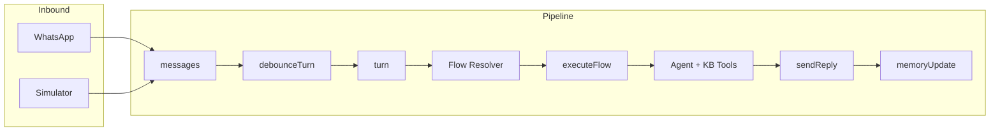

# WhatsApp Agentic Engine

Professional conversational agentic system built in **Next.js + MongoDB** that allows orchestrating LLM agents with memory, tools, configurable flows, and integrated testing.

## Overview

Agentic engine that:

- ✅ Ingests messages from WhatsApp (Baileys) or internal simulator
- ✅ Consolidates inputs into turns with debouncing
- ✅ Executes configurable flows per session
- ✅ Orchestrates LLM agents with function calling
- ✅ Maintains conversational memory (facts + recap)
- ✅ Supports human mode with automatic cooldown
- ✅ Integrated testing harness (chat simulator)
- ✅ Fully traceable and observable

**Architecture oriented to:** determinism + observability + extensibility

---

## Architecture

### Complete Pipeline

```
message → debounceTurn → turn
turn → executeFlow → agent + tools + KB
agent → sendReply → outbound
→ memoryUpdate → facts + recap
```

### Flow Diagram (Mermaid)



Flow: **WhatsApp/Sim** → messages → debounceTurn → turn → **Flow Resolver** (draft/published) → executeFlow → **Agent** (with KB Tools) → sendReply → memoryUpdate.

### Flow Diagram (ASCII)

```
┌─────────────────────────────────────────────────────────────┐
│                    Inbound (WhatsApp / Sim)                  │
└──────────────────────────┬──────────────────────────────────┘
                           ↓
┌─────────────────────────────────────────────────────────────┐
│  messages collection (processed: false)                      │
└──────────────────────────┬──────────────────────────────────┘
                           ↓
┌─────────────────────────────────────────────────────────────┐
│  debounceTurn job (3s)                                       │
└──────────────────────────┬──────────────────────────────────┘
                           ↓
┌─────────────────────────────────────────────────────────────┐
│  turn creation (consolidate messages)                        │
└──────────────────────────┬──────────────────────────────────┘
                           ↓
┌─────────────────────────────────────────────────────────────┐
│  resolveFlow(sessionId) → draft/published or filesystem       │
└──────────────────────────┬──────────────────────────────────┘
                           ↓
┌─────────────────────────────────────────────────────────────┐
│  executeFlow (simple/FSM mode)                               │
│    - KB v2 (md + tables)                                     │
│    - run agent + tools                                       │
└──────────────────────────┬──────────────────────────────────┘
                           ↓
┌─────────────────────────────────────────────────────────────┐
│  sendReply (if responses enabled)                            │
└──────────────────────────┬──────────────────────────────────┘
                           ↓
┌─────────────────────────────────────────────────────────────┐
│  memoryUpdate (facts + recap)                                │
└─────────────────────────────────────────────────────────────┘
```

---

## Technology Stack

- **Framework**: Next.js 16.1.6 (App Router)
- **Database**: MongoDB
- **LLM**: OpenAI (gpt-4o-mini / gpt-4o / gpt-5-mini / gpt-5-nano)
- **UI**: React 19 + shadcn/ui + Tailwind CSS 4 + Monaco Editor
- **WhatsApp**: Baileys API (webhook + send)
- **Worker**: tsx (local) + Vercel Cron
- **TypeScript**: strict mode

---

## Admin UI

Interface protected by authentication (`/login`) to manage sessions, flows, prompts, and KB.

### Main Dashboard (`/`)

- Health monitor: Baileys API status (latency) and MongoDB
- Sessions table: status, conversation count, last activity
- Quick links: simulator and flow configuration per session

### Session Configuration (`/ui/sessions/[sessionId]`)

- **Flow editor**: JSON with Monaco Editor; validate, save draft, and publish
- **Diff viewer**: draft vs published comparison (unified diff)
- **Prompt editor per agent**: `default_assistant`, `cami_default`, `cami_recommender`
  - System prompt, model, temperature, max tool rounds
  - Draft/publish with validation (length, placeholders)
- **Runtime config**: resolution mode
  - `auto`: uses published if exists, otherwise filesystem
  - `force_draft`: forces draft (testing)
  - `force_published`: forces published
- Quick links: simulator, KB manager, conversations

### Knowledge Base Manager (`/kb/[sessionId]`)

- **Markdown tab**: CRUD of documents (slug, title, content); preview; filter by status (active/archived)
- **Tables tab**: KB tables listing; row query with text search
- Markdown documents are automatically reindexed when saved

### Conversations List (`/conversations`)

- Conversations table with filter by session (all or one)
- Last message, response status (enabled/cooldown)
- Link to conversation detail (`/conversations/[whatsappId]`)

### Conversation Detail (`/conversations/[whatsappId]`)

- Message history
- Toggle to enable/disable bot responses
- Form to send manual message (optional)

---

## Phase 1 — Message Gateway + Persistence

### Objective

Own infrastructure to replace n8n.

### Flow

**Inbound:**

```
Webhook → messages (processed=false)
```

**Outbound:**

```
sendReply → Baileys API → messages (source=bot)
```

### Model: `messages`

```ts
{
  whatsappId: string        // conversation key
  sessionId: string         // bot connection
  userID: string
  channel: "whatsapp" | "simulator"
  messageText: string
  messageTime: number
  source: "user" | "bot"
  processed: boolean
  botMessageId?: string
}
```

**Indexes:** by conversation + status.

### Endpoints

- `POST /api/whatsapp/webhook` — receives messages from Baileys
- `POST /api/whatsapp/send` — sends messages via Baileys
- `POST /api/conversations/[whatsappId]/responses-enabled` — human mode control

---

## Phase 2 — Agentic Runtime

### Key Models

#### `turns` (stable input)

```ts
{
  whatsappId: string
  sessionId: string
  userID: string
  text: string
  messageIds: ObjectId[]
  status: "queued" | "running" | "done" | "failed" | "blocked"
  router?: string
  response?: string
  channel: "whatsapp" | "simulator"
  meta?: Record<string, unknown>
  createdAt: Date
}
```

#### `agent_runs` (full trace)

```ts
{
  turnId: ObjectId
  agentId: string
  input: {
    systemPrompt: string
    context: string
    messages: Array<{role, content}>
  }
  output?: {
    assistantText?: string
    toolCalls?: ToolCall[]
  }
  status: "pending" | "running" | "done" | "failed"
  error?: string
  createdAt: Date
  updatedAt: Date
}
```

#### `memory`

```ts
{
  whatsappId: string;
  facts: Array<{
    key: string;
    value: string;
    confidence: number;
  }>;
  recap: {
    text: string;
    updatedAt: Date;
  }
  updatedAt: Date;
}
```

#### `conversation_state`

Structural state per conversation (FSM, steps, custom data).

```ts
{
  whatsappId: string
  sessionId: string
  state?: string
  data?: Record<string, unknown>
  updatedAt: Date
}
```

#### `jobs`

Internal queue (MongoDB) with:

- `debounceTurn` — consolidates messages
- `runAgent` — runs agent
- `sendReply` — sends reply
- `memoryUpdate` — updates memory

```ts
{
  type: string
  status: "pending" | "running" | "done" | "failed"
  payload: Record<string, unknown>
  retries: number
  maxRetries: number
  scheduledAt: Date
  lockedBy?: string
  lockedAt?: Date
  error?: string
}
```

### Agent Router

Resolution order:

1. **Deterministic rules** (keywords, commands)
2. **Fallback LLM** (JSON classifier with GPT-4o-mini)

Available agents:

- `default_assistant` — general assistant
- `cami_default` — base Cami agent
- `cami_recommender` — specialized recommender

### Available Tools

Integrated function calling. **Total: 9 tools** (4 core + 5 KB v2).

**Core:**

- `send_message` — sends additional message to user
- `set_responses_enabled` — enables/disables automatic responses (with optional cooldown)
- `get_recent_messages` — gets recent history (configurable limit)
- `http_fetch` — HTTP GET to allowed URLs (safe, timeout)

**KB v2:**

- `kb_md_search` — search in markdown documents
- `kb_md_get` — get full document by slug
- `kb_table_lookup` — search in table by text
- `kb_table_get` — get row by primary key
- `kb_table_query` — structured query with filters

### Human Mode

Control per conversation:

```ts
responsesEnabled = {
  enabled: boolean
  disabledUntilUTC?: string  // cooldown until timestamp
}
```

- Automatically activates when `fromMe` message enters
- Default cooldown: 2 hours
- Respected before every automatic response

**Endpoints:**

- `GET /api/conversations/[whatsappId]/responses-enabled`
- `POST /api/conversations/[whatsappId]/responses-enabled`

---

## Phase 3 — Flows per Session

> `sessionId` = one connection/bot; multiple conversations per session.

Flows can live in **MongoDB** (draft/published) or in **filesystem** (`/flows/default`, `/flows/session_<id>`). See [Flow and Prompt Management](#flow-and-prompt-management).

### Repo Structure

```
/flows
  /default
    flow.json
    kb/*.md
  /session_<id>
    flow.json
    kb/*
```

### Resolution

According to `sessionRuntimeConfig.configMode`: **auto** (published if exists, otherwise filesystem), **force_draft** or **force_published**. If no flow in DB, uses filesystem: `session_<sessionId>` if exists, otherwise `default`.

### Flow Modes (MVP)

#### 1. Simple

```json
{
  "mode": "simple",
  "agent": "default_assistant",
  "kb": {
    "enabled": true,
    "topK": 4
  }
}
```

#### 2. FSM (Finite State Machine)

States with `reply`, `agent`, `router` or `end`. Transitions with `match: { keyword }`, `match: { any: true }` or `match: { default: true }`. State persisted in `conversation_state`.

**Minimal example:**

```json
{
  "mode": "fsm",
  "initialState": "greeting",
  "states": {
    "greeting": {
      "reply": "¡Hola! ¿En qué puedo ayudarte?",
      "transitions": [{ "match": { "any": true }, "next": "ROUTER" }]
    },
    "ROUTER": {
      "router": {
        "type": "keyword",
        "routes": [
          { "keyword": "hola", "next": "SALUDO" },
          { "default": true, "next": "NO_ENTENDI" }
        ]
      }
    },
    "SALUDO": {
      "reply": "Hola! En qué puedo ayudarte?",
      "transitions": [{ "match": { "any": true }, "next": "ROUTER" }]
    },
    "NO_ENTENDI": {
      "reply": "No llegué a entender. ¿Me contás qué buscás?",
      "transitions": [{ "match": { "any": true }, "next": "ROUTER" }]
    }
  }
}
```

**Keyword router:**

```json
{
  "router": {
    "type": "keyword",
    "routes": [
      { "keyword": "hola", "next": "SALUDO" },
      { "keyword": "pedido", "next": "ESCALATE" },
      { "default": true, "next": "NO_CLARO" }
    ]
  }
}
```

**AI Router (LLM):**

```json
{
  "router": {
    "type": "ai",
    "instruction": "Clasifica la intención del usuario.",
    "routes": [
      {
        "name": "comprar",
        "description": "Usuario quiere comprar",
        "next": "COMPRA"
      },
      { "name": "consulta", "description": "Tiene una pregunta", "next": "FAQ" }
    ]
  }
}
```

**Real example:** [flows/session_iutopyBusiness/flow.json](flows/session_iutopyBusiness/flow.json) — FSM with 12+ product categories, nested keyword routers (e.g., seeds → indoor/outdoor → auto/photo → agent), human escalation states, and offtopic.

---

## KB v2 System

Dual system: markdown documents and structured tables, per session. Agents access via tools (`kb_md_*`, `kb_table_*`).

### Markdown KB

- **Collections**: `kbMdDocs` (documents), `kbMdChunks` (chunks)
- **Fields**: slug, title, content, status (active/archived)
- **Chunking**: by headers; chunks up to 3200 characters with 400 overlap
- **Search**: text in MongoDB with scoring; filter by slug
- **CRUD API**:
  - `POST /api/kb/md` — create document (body: sessionId, slug, title, content)
  - `GET /api/kb/md` — list (query: sessionId, status)
  - `GET /api/kb/md/[docId]` — get
  - `PUT /api/kb/md/[docId]` — update (triggers reindex)
  - `DELETE /api/kb/md/[docId]` — archive

### Tables KB

- **Collections**: `kbTables` (definition), `kbRows` (rows), `kbSyncRuns` (sync history)
- **Sync**: from n8n or other client via `POST /api/kb/tables/[sessionId]/[tableKey]/sync`
  - Header: `Authorization: Bearer <KB_SYNC_TOKEN>`
  - Payload: `batchId`, `mode: "mirror"`, `primaryKey`, `rows` (max. 10,000)
  - Mirror mode: upsert by primaryKey and deletes rows not present in batch
  - Idempotency: same `batchId` does not reprocess
- **Query**: text search with scoring; numeric hints extraction (e.g., "20l", "20 lts")
- **API**:
  - `GET /api/kb/tables` — list tables (query: sessionId)
  - `GET /api/kb/tables/[sessionId]/[tableKey]/rows` — rows (query: query, limit)

Detailed documentation: [docs/KB_SYNC_API.md](docs/KB_SYNC_API.md).

### Agent KB Tools (v2)

- `kb_md_search` — search in markdown documents
- `kb_md_get` — get full document by slug
- `kb_table_lookup` — search in table by text
- `kb_table_get` — get row by primary key
- `kb_table_query` — structured query with filters

---

## Flow and Prompt Management

Flows and prompts can be edited in **draft** in MongoDB and published to production without redeploy.

### Draft/Published Versioning

1. Edit flow or prompt in **draft** (saved in MongoDB)
2. Validate (syntax, agent/state references)
3. View diff vs published
4. Publish; runtime uses published (or draft if `force_draft`)

### Collections

- `flowDocuments`: flow per session (draft + published)
- `agentPromptDocuments`: prompt per session and agent (draft + published)
- `sessionRuntimeConfig`: resolution mode (auto / force_draft / force_published)

### Runtime Resolution

- `auto` (default): uses published if exists, otherwise flow/prompt from filesystem
- `force_draft`: always uses draft (useful for testing in simulator)
- `force_published`: always uses published

### Flow API

| Method | Route                                                         | Description             |
| ------ | ------------------------------------------------------------- | ----------------------- |
| GET    | `/api/ui/sessions/[sessionId]/flow?version=draft\|published` | Get flow                |
| PUT    | `/api/ui/sessions/[sessionId]/flow`                          | Update draft            |
| POST   | `/api/ui/sessions/[sessionId]/flow/publish`                   | Publish draft           |
| POST   | `/api/ui/sessions/[sessionId]/flow/validate`                  | Validate without saving |
| GET    | `/api/ui/sessions/[sessionId]/flow/diff`                      | Diff draft vs published |

### Prompt API

| Method | Route                                                                            | Description      |
| ------ | -------------------------------------------------------------------------------- | ---------------- |
| GET    | `/api/ui/sessions/[sessionId]/agents/[agentId]/prompt?version=draft\|published` | Get prompt       |
| PUT    | `/api/ui/sessions/[sessionId]/agents/[agentId]/prompt`                           | Update draft     |
| POST   | `/api/ui/sessions/[sessionId]/agents/[agentId]/prompt/publish`                  | Publish draft    |

### Runtime Config API

| Method | Route                                          | Description                                      |
| ------ | ---------------------------------------------- | ------------------------------------------------ |
| GET    | `/api/ui/sessions/[sessionId]/runtime-config` | Get configMode                                   |
| PUT    | `/api/ui/sessions/[sessionId]/runtime-config` | Update configMode (clears resolver cache)        |

All routes under `/api/ui/` require authentication.

---

## Chat Simulator (real testing)

### Key Principle

It's not another system → it's another **channel**. The entire pipeline is the same as WhatsApp: messages → turns → flow resolver → agent + KB tools → sendReply → memoryUpdate.

### Conversation Identity

Reuses `whatsappId` with prefix:

```
sim:<sessionId>:<testUserId>
```

Example: `sim:default:user_1`. Isolates state and memory per test conversation.

### UI (`/sim` and `/sim/[sessionId]`)

- **Session selector** and list of simulated conversations (create new with `testUserId`)
- **Chat window**: send messages; indicator of active config (Draft/Published)
- **Config override**: query param to force draft or published in that conversation
- **Actions**: conversation reset (clears state + memory), clear cooldown, export JSON

### Debug Panel

Real-time for active conversation:

- **Turn**: status, agentId, duration, flow path, FSM state
- **AI classification**: chosen route, confidence, reasoning (if applicable)
- **KB usage**: used markdown chunks (titles), used table rows (detail), total counters
- **Cooldown**: status and control to enable/disable responses
- **Flow**: mode (simple/FSM) and current state

### Simulator API

| Method | Route                                               | Description                                                  |
| ------ | --------------------------------------------------- | ------------------------------------------------------------ |
| GET    | `/api/sim/sessions/[sessionId]/conversations`       | List conversations                                           |
| POST   | `/api/sim/sessions/[sessionId]/conversations`       | Create (body: `testUserId`)                                  |
| GET    | `/api/sim/conversations/[conversationId]/messages` | History (limit 200)                                          |
| POST   | `/api/sim/conversations/[conversationId]/messages` | Send message (optional: `configOverride`: draft/published)     |
| POST   | `/api/sim/conversations/[conversationId]/reset`   | Reset state and memory                                       |

For turn and agent run debugging, reuse:

- `GET /api/conversations/[whatsappId]/turns`
- `GET /api/turns/[turnId]`
- `GET /api/agent-runs/[runId]`

### sendReply

Per channel: `whatsapp` → Baileys API; `simulator` → only persistence in `messages` (no HTTP send).

---

## Installation

### Requirements

- Node.js 20+
- MongoDB 6+
- OpenAI API Key
- Baileys API (optional, for real WhatsApp)

### Setup

1. Clone repo:

```bash
git clone <repo-url>
cd whatsapp-bot-v2
npm install
```

2. Configure `.env`:

```bash
# MongoDB
MONGODB_URI=mongodb://localhost:27017
MONGODB_DB_NAME=whatsapp_agentic

# OpenAI
OPENAI_API_KEY=sk-...

# Baileys (optional, for real WhatsApp)
BAILEYS_API_URL=http://localhost:3001
BAILEYS_API_KEY=your-secret-key

# Cron (optional, for Vercel)
CRON_SECRET=your-cron-secret

# Login (optional)
LOGIN_USERNAME=admin
LOGIN_PASSWORD=secret

# KB sync from n8n (optional)
KB_SYNC_TOKEN=your-kb-sync-token
```

3. Start development:

```bash
npm run dev
```

4. Start worker (local):

```bash
npm run worker
```

---

## Usage

### Testing with Simulator

1. Go to `http://localhost:3000/sim`
2. Select `sessionId` (e.g., `default`)
3. Create test conversation
4. Send messages
5. View debug panel in real-time

### Production with WhatsApp

1. Configure Baileys API
2. Configure webhook in Baileys → `https://your-domain.com/api/whatsapp/webhook`
3. Send header `Authorization: Bearer <BAILEYS_API_KEY>`
4. Configure Vercel Cron (optional):

```json
{
  "crons": [
    {
      "path": "/api/cron/jobs",
      "schedule": "* * * * *"
    }
  ]
}
```

5. Deploy to Vercel:

```bash
vercel --prod
```

---

## Scripts

| Script                    | Description                                                                                             |
| ------------------------- | ------------------------------------------------------------------------------------------------------- |
| `npm run dev`             | Development with Turbo                                                                                  |
| `npm run build`           | Production build                                                                                        |
| `npm start`               | Production server                                                                                       |
| `npm run worker`          | Local worker: processes jobs (debounceTurn, runAgent, sendReply, memoryUpdate, kbReindexMarkdown) in loop |
| `npm run lint`            | Linter                                                                                                  |
| `npm run seed-kb`         | Initial KB seed from files in `flows/*/kb/`                                                             |
| `npm run test-classifier` | AI classifier test (router type `ai`)                                                                   |

**Migration scripts** (run with `npx tsx`):

- `scripts/migrate-flows-to-db.ts` — migrate flows from filesystem to MongoDB (draft/published)
- `scripts/migrate-prompts-to-db.ts` — migrate agent prompts from defaults to MongoDB

---

## Main Endpoints

### Auth

| Method | Route               | Description                                                  |
| ------ | ------------------- | ------------------------------------------------------------ |
| POST   | `/api/auth/login`   | Login (body: username, password); sets session cookie        |
| POST   | `/api/auth/logout`  | Logout; clears cookie                                        |

### Dashboard

| Method | Route                      | Description                                                     |
| ------ | -------------------------- | --------------------------------------------------------------- |
| GET    | `/api/dashboard/overview`  | System summary (Baileys, MongoDB, sessions); requires auth      |

### WhatsApp

| Method | Route                    | Description                |
| ------ | ------------------------ | -------------------------- |
| POST   | `/api/whatsapp/webhook`  | Receives messages from Baileys |
| POST   | `/api/whatsapp/send`     | Sends message via Baileys  |

### Conversations

| Method | Route                                                | Description                                                 |
| ------ | ---------------------------------------------------- | ----------------------------------------------------------- |
| GET    | `/api/conversations`                                 | List conversations (query: `sessionId`)                   |
| GET    | `/api/conversations/[whatsappId]/messages`           | Conversation messages                                       |
| GET    | `/api/conversations/[whatsappId]/turns`              | Turn history (query: `limit`, max. 50)                    |
| GET    | `/api/conversations/[whatsappId]/responses-enabled`  | Response status                                             |
| POST   | `/api/conversations/[whatsappId]/responses-enabled`  | Update responses (body: `enabled`, `disabledUntilUTC`)      |

### Turns and Agent Runs (debug)

| Method | Route                      | Description                    |
| ------ | -------------------------- | ------------------------------ |
| GET    | `/api/turns/[turnId]`      | Turn detail                    |
| GET    | `/api/agent-runs/[runId]`  | Agent execution detail         |

### UI — Flows and Prompts (require auth)

| Method | Route                                                           | Description                                      |
| ------ | --------------------------------------------------------------- | ------------------------------------------------ |
| GET    | `/api/ui/sessions/[sessionId]/flow`                             | Get flow (query: `version=draft\|published`)     |
| PUT    | `/api/ui/sessions/[sessionId]/flow`                             | Update draft                                     |
| POST   | `/api/ui/sessions/[sessionId]/flow/publish`                     | Publish flow                                     |
| POST   | `/api/ui/sessions/[sessionId]/flow/validate`                    | Validate without saving                          |
| GET    | `/api/ui/sessions/[sessionId]/flow/diff`                        | Diff draft vs published                          |
| GET    | `/api/ui/sessions/[sessionId]/agents/[agentId]/prompt`          | Get prompt                                       |
| PUT    | `/api/ui/sessions/[sessionId]/agents/[agentId]/prompt`          | Update prompt draft                              |
| POST   | `/api/ui/sessions/[sessionId]/agents/[agentId]/prompt/publish` | Publish prompt                                   |
| GET    | `/api/ui/sessions/[sessionId]/runtime-config`                   | Get configMode                                   |
| PUT    | `/api/ui/sessions/[sessionId]/runtime-config`                   | Update configMode                                |

### Knowledge Base

| Method | Route                                         | Description                                                    |
| ------ | --------------------------------------------- | -------------------------------------------------------------- |
| GET    | `/api/kb/md`                                  | List documents (query: `sessionId`, `status`)                  |
| POST   | `/api/kb/md`                                  | Create document                                                |
| GET    | `/api/kb/md/[docId]`                          | Get document                                                   |
| PUT    | `/api/kb/md/[docId]`                          | Update document                                                |
| DELETE | `/api/kb/md/[docId]`                          | Archive document                                               |
| GET    | `/api/kb/tables`                              | List tables (query: `sessionId`)                             |
| GET    | `/api/kb/tables/[sessionId]/[tableKey]/rows`  | Rows (query: `query`, `limit`)                               |
| POST   | `/api/kb/tables/[sessionId]/[tableKey]/sync`  | Sync from n8n (header: `Authorization: Bearer KB_SYNC_TOKEN`)  |

### Simulator

| Method | Route                                               | Description                |
| ------ | --------------------------------------------------- | -------------------------- |
| GET    | `/api/sim/sessions/[sessionId]/conversations`       | List conversations         |
| POST   | `/api/sim/sessions/[sessionId]/conversations`       | Create (body: `testUserId`) |
| GET    | `/api/sim/conversations/[conversationId]/messages`    | History                    |
| POST   | `/api/sim/conversations/[conversationId]/messages`    | Send message               |
| POST   | `/api/sim/conversations/[conversationId]/reset`     | Reset conversation         |

### Cron

| Method | Route             | Description                                                         |
| ------ | ----------------- | ------------------------------------------------------------------- |
| GET    | `/api/cron/jobs`  | Process up to 10 jobs (header: `Authorization: Bearer CRON_SECRET`) |

---

## Project Structure

```
whatsapp-bot-v2/
├── app/
│   ├── api/
│   │   ├── auth/            # Login / logout
│   │   ├── dashboard/       # System overview
│   │   ├── whatsapp/        # WhatsApp gateway
│   │   ├── conversations/   # Conversation management
│   │   ├── turns/           # Turn debug
│   │   ├── agent-runs/      # Agent run debug
│   │   ├── ui/              # Flows, prompts, runtime-config (auth)
│   │   ├── kb/              # Markdown docs + tables
│   │   ├── sim/             # Simulator endpoints
│   │   └── cron/            # Worker cron
│   ├── ui/sessions/[sessionId]/  # Session configuration (flows, prompts)
│   ├── kb/[sessionId]/      # KB Manager UI
│   ├── sim/                 # Simulator UI
│   ├── conversations/       # Conversations list and detail
│   ├── login/               # Auth
│   └── page.tsx             # Main dashboard
├── lib/
│   ├── agents/              # Agents + tools
│   ├── flows/               # Flow engine (resolver, runtime, validator)
│   ├── kb/                  # KB legacy
│   ├── kb-v2/               # KB v2 (md + tables, sync)
│   ├── jobs.ts              # Job queue
│   ├── memory.ts            # Conversational memory
│   ├── router.ts            # Agent router
│   └── turns.ts             # Turn management
├── flows/
│   ├── default/             # Default flow
│   │   ├── flow.json
│   │   └── kb/
│   └── session_<id>/        # Flows per session
├── components/              # React (simulator, flow-editor, kb-manager, etc.)
├── scripts/
│   ├── worker.ts            # Local worker
│   ├── seed-kb.ts           # Seed KB from files
│   ├── migrate-flows-to-db.ts
│   ├── migrate-prompts-to-db.ts
│   └── test-classifier.ts   # AI classifier test
└── docs/                    # Documentation (KB_SYNC_API.md, etc.)
```

---

## MongoDB Architecture

**17 collections** in the database configured by `MONGODB_DB_NAME`.

| Group                 | Collection              | Usage                                                              |
| --------------------- | ---------------------- | ---------------------------------------------------------------- |
| **Core messaging**    | `messages`             | Incoming/outgoing messages (WhatsApp + Simulator)                  |
|                       | `turns`                | Message consolidation into turns                                   |
|                       | `agentRuns`            | Agent execution traces                                             |
| **Memory and state**  | `memory`               | Facts + recap per conversation                                     |
|                       | `conversationState`    | FSM state + custom data per conversation                         |
| **Configuration**     | `responsesEnabled`     | Automatic response control + cooldown                            |
|                       | `flowDocuments`        | Flows (draft/published) per session                                |
|                       | `agentPromptDocuments` | Prompts per agent/session                                          |
|                       | `sessionRuntimeConfig` | Resolution mode (auto / force_draft / force_published)           |
|                       | `sessions`             | Session metadata (name, description)                               |
| **Knowledge Base v2** | `kbMdDocs`             | Markdown documents                                                 |
|                       | `kbMdChunks`           | Document chunks                                                    |
|                       | `kbTables`             | Table definitions                                                |
|                       | `kbRows`               | Table rows                                                       |
|                       | `kbSyncRuns`           | Sync history                                                     |
| **System**            | `jobs`                 | Async job queue (debounceTurn, runAgent, sendReply, etc.)        |
|                       | `locks`                | Distributed locks to prevent race conditions                       |

---

## Architectural Principles

✅ **Determinism** — turns with locks, no race conditions
✅ **Observability** — all execution in `agent_runs`
✅ **Extensibility** — flows and prompts with draft/published without redeploy
✅ **Testability** — simulator with same pipeline and debug panel
✅ **Multi-session** — multiple bots in one deploy
✅ **Human-in-the-loop** — automatic cooldown
✅ **Knowledge Base v2** — markdown + tables per session; sync from n8n
✅ **Scalability** — ready for multi-agent / planners

---

## Roadmap

### ✅ Completed

- [x] Own gateway (n8n replacement)
- [x] Agentic runtime
- [x] Conversational memory (facts + recap)
- [x] Hybrid router (rules + LLM)
- [x] Flows per session (simple + FSM)
- [x] Simulator with debug panel
- [x] File-driven Knowledge Base
- [x] Human mode with cooldown
- [x] Knowledge Base v2 (markdown + tables)
- [x] Admin UI (dashboard, flows, prompts, KB, conversations)
- [x] Flow and prompt management with draft/published
- [x] KB sync API (n8n)
- [x] AI routers in FSM
- [x] Monitoring dashboard

### 🚀 Next Steps

- [ ] Automatic conversation replay
- [ ] Response quality metrics
- [ ] A/B testing per flow
- [ ] Vector embeddings (Pinecone/Qdrant)
- [ ] Multi-step planner
- [ ] Multi-agent orchestration
- [ ] Streaming responses
- [ ] Voice message support
- [ ] Media handling (images/docs)

---

## Environment Variables

### Required

| Variable          | Description             |
| ----------------- | ----------------------- |
| `MONGODB_URI`     | MongoDB connection      |
| `MONGODB_DB_NAME` | Database name           |
| `OPENAI_API_KEY`  | OpenAI API key          |

### Optional

| Variable          | Description                                                                   | Default |
| ----------------- | ----------------------------------------------------------------------------- | ------- |
| `BAILEYS_API_URL` | Baileys API URL                                                               | -       |
| `BAILEYS_API_KEY` | Baileys auth                                                                  | -       |
| `CRON_SECRET`     | Vercel Cron auth                                                              | -       |
| `LOGIN_USERNAME`  | Admin user                                                                    | -       |
| `LOGIN_PASSWORD`  | Admin password                                                                | -       |
| `KB_SYNC_TOKEN`   | Bearer token for `POST /api/kb/tables/[sessionId]/[tableKey]/sync` (e.g., n8n) | -       |

---

## Debug and Troubleshooting

### View Turn Logs

```bash
curl http://localhost:3000/api/turns/<turnId>
```

### View Agent Run

```bash
curl http://localhost:3000/api/agent-runs/<runId>
```

### View Conversation Memory

Inspect `memory` collection in MongoDB:

```js
db.memory.findOne({ whatsappId: "..." });
```

### View Job Status

```js
db.jobs.find({ status: "pending" }).sort({ scheduledAt: 1 });
```

### Force Job Processing

Local:

```bash
npm run worker
```

Vercel:

```bash
curl https://your-domain.com/api/cron/jobs \
  -H "Authorization: Bearer <CRON_SECRET>"
```

---

## Contributing

1. Fork the repo
2. Create branch: `git checkout -b feature/new-feature`
3. Commit: `git commit -m "feat: description"`
4. Push: `git push origin feature/new-feature`
5. Open Pull Request

---

## License

Private / Proprietary

---

## Support

For questions or issues, contact the development team.

---

**Built with** ❤️ **using Next.js + MongoDB + OpenAI**
